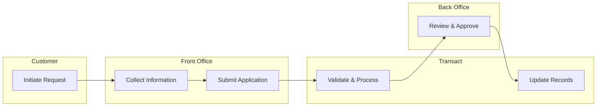

# /create-process-flow

Generate a business process flow diagram from the Temenos Transact process library.

## Usage
```
/create-process-flow <process-area> <sub-process> [programme]
```

| Parameter | Required | Description |
|---|---|---|
| `process-area` | Yes | The process area name or number (e.g., `retail-banking`, `02`, `transactional`) |
| `sub-process` | Yes | The specific process to diagram (e.g., `account-opening`, `payments-processing`) |
| `programme` | No | Programme name. If omitted, uses the active programme in `pipeline/active/`. If multiple active, asks which one. |

## What It Does

1. **Locate the process area** — reads the matching file from `business-processes/` (e.g., `02-retail-banking.md`)
2. **Extract process context** — pulls the summary, sub-processes, and any existing fit-gap status
3. **Generate the flow diagram** — creates a Mermaid swimlane diagram with:
   - Lanes for each role/actor (Customer, Front Office, Back Office, Transact, External Systems)
   - Steps mapped to Transact capabilities
   - Decision points and exception paths
   - Fit-gap annotations where Transact doesn't fully cover the step
4. **Save the output** — writes to `pipeline/active/<programme>/artefacts/process-flows/<sub-process>.md`
5. **Link to fit-gap register** — if gaps are identified, adds cross-references to `03-fit-gap-register/`

## Process Library

The process library lives in `business-processes/` with 22 domain files covering 2,485+ Temenos Transact processes:

| # | Process Area | File | Processes |
|---|---|---|---|
| 01 | Customer Relationship Management | `01-customer-relationship-management.md` | 59 |
| 02 | Retail Banking | `02-retail-banking.md` | 166 |
| 03 | Corporate Banking | `03-corporate-banking.md` | 238 |
| 04 | Transactional | `04-transactional.md` | 496 |
| 05 | Treasury | `05-treasury.md` | 79 |
| 06 | Private Wealth Management | `06-private-wealth-management.md` | 319 |
| 07 | Online Channels | `07-online-channels.md` | 116 |
| 08 | Security Management | `08-security-management.md` | 5 |
| 09 | Financial Accounting Parameters | `09-financial-accounting-parameters.md` | 34 |
| 10 | Core Parameters | `10-core-parameters.md` | 9 |
| 11 | Islamic Banking | `11-islamic-banking.md` | 134 |
| 12 | Regionalized Solutions | `12-regionalized-solutions.md` | 268 |
| 13 | Digital Engagement | `13-digital-engagement.md` | 22 |
| 14 | Regulatory Reporting & Compliance | `14-regulatory-reporting-compliance.md` | 66 |
| 15 | Financial Crime Mitigation | `15-financial-crime-mitigation.md` | 74 |
| 16 | Fund Accounting | `16-fund-accounting.md` | 69 |
| 17 | Temenos Digital | `17-temenos-digital.md` | 46 |
| 18 | Temenos Banking Solution | `18-temenos-banking-solution.md` | 75 |
| 19 | Business Banking | `19-business-banking.md` | 34 |
| 20 | Enterprise Services | `20-enterprise-services.md` | 157 |
| 21 | Financial Risk Management | `21-financial-risk-management.md` | 19 |
| 22 | Platform Based Approach | `22-platform-based-approach.md` | 275 |

## Output Format

Each generated process flow file follows this structure:

```markdown
---
process-id: <AREA>-NNN
domain: <Process Area>
sub-process: <Sub-Process Name>
programme: <Programme Name>
transact-module: <Transact Module>
complexity: Low | Medium | High
fit-gap-status: fit | gap | partial | pending
created: YYYY-MM-DD
---

# <Sub-Process Name> — Process Flow

## Context
Brief description from the process library.

## Swimlane Diagram



## Steps

| Step | Actor | Transact Capability | Fit/Gap | Notes |
|---|---|---|---|---|
| Initiate Request | Customer | — | — | |
| Collect Information | Front Office | Customer Onboarding | Fit | |
| Submit Application | Front Office | Application Processing | Fit | |
| Validate & Process | Transact | Core Validation | Fit | |
| Review & Approve | Back Office | Authorisation Workflow | Partial | Custom approval levels |
| Update Records | Transact | Account Maintenance | Fit | |

## Gap Summary

| Step | Gap Description | Customisation Request | ADR Ref |
|---|---|---|---|
| Review & Approve | Approval workflow requires 3 levels, Transact supports 2 | CR-XXX | ADR-XXX |

## Cross-References

- Fit-Gap Register: `artefacts/03-fit-gap-register/fit-gap-register.md`
- Target-State Architecture: `artefacts/02-target-state-reference-architecture/business-capability-map.md`
- Programme Status: `pipeline/active/<programme>/STAGE-STATUS.md`
```

## Examples

```
/create-process-flow retail-banking account-opening
/create-process-flow corporate-banking trade-finance
/create-process-flow 01 customer-onboarding
```

## Behaviour

- If the process area name doesn't match exactly, fuzzy-match against the 22 areas and ask the user to confirm
- If the sub-process isn't found in the area's Key Sub-Processes list, ask the user to describe it and generate from description
- If no programme is specified and there's exactly one active programme, use it automatically
- If no programme is specified and there are multiple active programmes, list them and ask which one
- If the output directory `pipeline/active/<programme>/artefacts/process-flows/` doesn't exist, create it
- Always include fit-gap annotations — mark steps as Fit, Gap, Partial, or Pending based on the process library's fit-gap status
