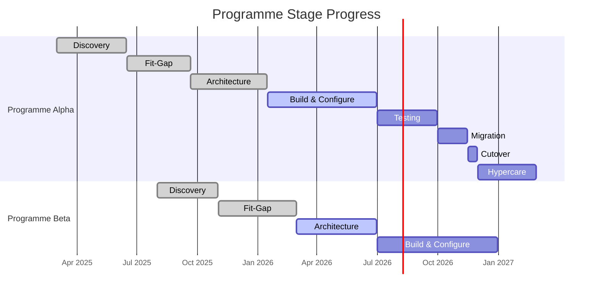

# Dashboard Reporting

**Status: PLACEHOLDER** — To be workshopped with full skills, scope, inputs, outputs, and examples.

## Intent

Aggregate programme status across all active pipelines, generate executive summaries for Steering Committee consumption, track artefact completion matrices, surface KPIs from the analytics folder, visualise risk and issue heatmaps, and provide cross-programme analytics that enable data-driven governance decisions. This agent is the single source of truth for programme health and delivery performance.

## Owns

- analytics/
- pipeline/*/STAGE-STATUS.md

## Active At

- All stages (1-8)

---

## Artifact Template: Implementation Dashboard & Reporting Pack

---

### 1. Executive Summary (1-Page Programme Health Summary)

```
┌─────────────────────────────────────────────────────────────────┐
│                 PROGRAMME HEALTH SUMMARY                        │
│                 Reporting Period: [YYYY-MM-DD to YYYY-MM-DD]    │
│                 Prepared by: [Name]    Date: [YYYY-MM-DD]       │
├─────────────────────────────────────────────────────────────────┤
│                                                                 │
│  OVERALL STATUS:  [GREEN / AMBER / RED]                         │
│                                                                 │
├────────────────┬────────────────┬────────────────┬──────────────┤
│   SCHEDULE     │    BUDGET      │    QUALITY     │    RISK      │
│   [G/A/R]      │    [G/A/R]     │    [G/A/R]     │    [G/A/R]   │
├────────────────┴────────────────┴────────────────┴──────────────┤
│                                                                 │
│  CURRENT STAGE: [Stage N - Name]                                │
│  NEXT GATE:     [Gate N+1 - Date]                               │
│  PI:            [PI N - Sprint X of Y]                          │
│                                                                 │
├─────────────────────────────────────────────────────────────────┤
│  KEY ACHIEVEMENTS THIS PERIOD                                   │
│  - [Achievement 1]                                              │
│  - [Achievement 2]                                              │
│  - [Achievement 3]                                              │
│                                                                 │
│  KEY RISKS / ISSUES                                             │
│  - [Risk/Issue 1 — Impact — Mitigation]                         │
│  - [Risk/Issue 2 — Impact — Mitigation]                         │
│                                                                 │
│  DECISIONS REQUIRED                                             │
│  - [Decision 1 — Options — Recommendation]                      │
│  - [Decision 2 — Options — Recommendation]                      │
│                                                                 │
│  NEXT PERIOD FOCUS                                              │
│  - [Priority 1]                                                 │
│  - [Priority 2]                                                 │
│  - [Priority 3]                                                 │
│                                                                 │
├─────────────────────────────────────────────────────────────────┤
│  BUDGET SNAPSHOT                                                │
│  Total Budget: $[X]M  |  Spent: $[Y]M  |  Forecast: $[Z]M     │
│  Variance: [+/-$W]M ([+/-N]%)                                  │
│                                                                 │
│  VELOCITY / DELIVERY                                            │
│  Planned SP: [X]  |  Delivered SP: [Y]  |  Predictability: [Z]%│
└─────────────────────────────────────────────────────────────────┘
```

**RAG Criteria:**

| Dimension | Green | Amber | Red |
|---|---|---|---|
| Schedule | On track or ahead of plan | <= 2 weeks behind; recovery plan in place | > 2 weeks behind; no viable recovery plan |
| Budget | Within 5% of plan | 5-10% over plan; mitigations identified | > 10% over plan; requires additional funding |
| Quality | Defect density below threshold; DQ scorecard all PASS | Minor quality issues; DQ scorecard has AT RISK domains | Critical defects open; DQ scorecard has FAIL domains |
| Risk | No high/critical risks unmitigated | High risks exist with mitigations in progress | Critical risks unmitigated; programme viability at risk |

---

### 2. KPI Dashboard

#### 2.1 Delivery KPIs

| KPI | Definition | Target | Current Value | Trend | Status |
|---|---|---|---|---|---|
| Velocity (Story Points / Sprint) | Average story points delivered per sprint per team | _Stable +/- 10%_ | _42 SP_ | Stable | GREEN |
| Sprint Completion Rate | % of committed stories completed in sprint | _>= 85%_ | _88%_ | Improving | GREEN |
| PI Predictability | Actual BV delivered / Planned BV | _>= 80%_ | _82%_ | Stable | GREEN |
| Cycle Time (Feature) | Average time from feature start to done | _<= 30 days_ | _28 days_ | Improving | GREEN |
| Lead Time (Idea to Production) | Average time from backlog entry to production deployment | _<= 60 days_ | _55 days_ | Improving | GREEN |
| Throughput (Features / PI) | Number of features completed per PI | _>= 15_ | _17_ | Stable | GREEN |

#### 2.2 Quality KPIs

| KPI | Definition | Target | Current Value | Trend | Status |
|---|---|---|---|---|---|
| Defect Density | Defects per 1,000 lines of code (or per feature) | _<= 2.0 per KLOC_ | _1.8_ | Improving | GREEN |
| Defect Escape Rate | % of defects found in production vs total defects | _<= 5%_ | _3.2%_ | Improving | GREEN |
| Test Coverage (Automated) | % of test cases automated | _>= 70%_ | _72%_ | Improving | GREEN |
| Test Execution Rate | % of planned test cases executed | _>= 95%_ | _97%_ | Stable | GREEN |
| Test Pass Rate | % of executed test cases passing | _>= 90%_ | _93%_ | Stable | GREEN |
| Data Quality Score (Overall) | Weighted average across all DQ dimensions and domains | _>= 98%_ | _97.5%_ | Improving | AMBER |

#### 2.3 Financial KPIs

| KPI | Definition | Target | Current Value | Trend | Status |
|---|---|---|---|---|---|
| Budget Burn Rate | Actual spend / elapsed time vs planned spend | _Within 5%_ | _+3%_ | Stable | GREEN |
| Earned Value (EV) | Value of work completed vs planned | _EV >= PV_ | _EV = $4.2M, PV = $4.0M_ | Ahead | GREEN |
| Cost Performance Index (CPI) | EV / Actual Cost | _>= 1.0_ | _1.02_ | Stable | GREEN |
| Schedule Performance Index (SPI) | EV / Planned Value | _>= 1.0_ | _1.05_ | Stable | GREEN |
| Estimate at Completion (EAC) | Forecasted total programme cost | _<= Budget + 5%_ | _$11.8M (Budget: $11.5M)_ | Stable | GREEN |

#### 2.4 Operational KPIs (Post-Go-Live / Hypercare)

| KPI | Definition | Target | Current Value | Trend | Status |
|---|---|---|---|---|---|
| System Availability | Core system uptime % | _>= 99.95%_ | _99.97%_ | Stable | GREEN |
| P1 Incident Count | Number of P1 incidents per week | _<= 1_ | _0_ | Improving | GREEN |
| MTTR (P1) | Mean time to resolve P1 incidents | _<= 1 hour_ | _45 min_ | Improving | GREEN |
| Change Success Rate | % of changes deployed without incident | _>= 95%_ | _96%_ | Stable | GREEN |
| Customer NPS | Net Promoter Score post-go-live | _>= 45_ | _42_ | Improving | AMBER |

---

### 3. Stage-Gate Progress Tracking

#### 3.1 Cross-Programme Stage Status

| Programme | Stage 1 Discovery | Stage 2 Fit-Gap | Stage 3 Architecture | Stage 4 Build | Stage 5 Testing | Stage 6 Migration | Stage 7 Cutover | Stage 8 Hypercare |
|---|---|---|---|---|---|---|---|---|
| _Programme Alpha_ | PASSED | PASSED | PASSED | **ACTIVE** | Pending | Pending | Pending | Pending |
| _Programme Beta_ | PASSED | PASSED | **ACTIVE** | Pending | Pending | Pending | Pending | Pending |
| _Programme Gamma_ | PASSED | **ACTIVE** | Pending | Pending | Pending | Pending | Pending | Pending |
| _Programme Delta_ | **ACTIVE** | Pending | Pending | Pending | Pending | Pending | Pending | Pending |

#### 3.2 Gate History

| Programme | Gate | Date | Decision | Conditions | Reviewer |
|---|---|---|---|---|---|
| _Programme Alpha_ | Gate 1 (Discovery) | _2025-06-15_ | PASS | None | _Steering Committee_ |
| _Programme Alpha_ | Gate 2 (Fit-Gap) | _2025-09-20_ | PASS | 2 conditions: resolve GL mapping, confirm vendor API | _Steering Committee_ |
| _Programme Alpha_ | Gate 3 (Architecture) | _2026-01-15_ | CONDITIONAL PASS | 1 condition: finalise DR architecture by Sprint 2 | _Design Authority_ |
| _Programme Beta_ | Gate 1 (Discovery) | _2025-11-01_ | PASS | None | _Steering Committee_ |
| _Programme Beta_ | Gate 2 (Fit-Gap) | _2026-02-28_ | PASS | None | _Steering Committee_ |

#### 3.3 Visual Stage Progress (Mermaid)



---

### 4. Artefact Completion Matrix

| Artefact | Programme Alpha | Programme Beta | Programme Gamma | Programme Delta |
|---|---|---|---|---|
| 01 - Architecture Decision Records | 85% (12/14 ADRs) | 40% (4/10 ADRs) | Not started | Not started |
| 02 - Solution Architecture Document | 100% | 60% | Not started | Not started |
| 03 - Fit-Gap Register | 100% | 100% | 70% (in progress) | Not started |
| 04 - Integration Specification | 75% (6/8 interfaces) | 30% (2/7 interfaces) | Not started | Not started |
| 05 - Data Quality Scorecard | 60% (3/5 domains) | Not started | Not started | Not started |
| 06 - Test Strategy & KPI Dashboard | 90% | 20% (draft) | Not started | Not started |
| 07 - Cutover Runbook | 30% (draft) | Not started | Not started | Not started |
| 08 - Post-Go-Live Operating Model | 20% (design phase) | Not started | Not started | Not started |

**Completion criteria:**
- Not started: 0%
- Draft: 1-30%
- In progress: 31-70%
- Review: 71-90%
- Complete: 91-100%

---

### 5. Risk & Issue Heatmap

#### 5.1 Risk Heatmap

| | **Impact: Low** | **Impact: Medium** | **Impact: High** | **Impact: Critical** |
|---|---|---|---|---|
| **Likelihood: High** | | _RISK-007_ | _RISK-003, RISK-009_ | _RISK-001_ |
| **Likelihood: Medium** | _RISK-010_ | _RISK-005, RISK-008_ | _RISK-002, RISK-006_ | |
| **Likelihood: Low** | _RISK-011_ | _RISK-012_ | _RISK-004_ | |

#### 5.2 Active Risks Summary

| Risk ID | Programme | Description | Impact | Likelihood | Owner | Mitigation | Status |
|---|---|---|---|---|---|---|---|
| RISK-001 | Alpha | Vendor API delivery delay threatens Sprint 3 dependency | Critical | High | Integration Lead | Weekly vendor checkpoint; mock service fallback | Open |
| RISK-002 | Alpha | Key Temenos SME departure risk | High | Medium | Programme Director | Cross-training; vendor support contract | Open |
| RISK-003 | Alpha | Data quality below threshold in GL domain | High | High | Data Migration Lead | Additional cleansing sprint; automated DQ monitoring | Open |
| RISK-004 | Beta | Regulatory change may impact scope | High | Low | Business Owner | Legal review in progress; change impact assessment | Open |
| RISK-005 | Alpha | Performance test environment not provisioned | Medium | Medium | Infrastructure Lead | Escalated; ETA confirmed for next sprint | Open |
| RISK-006 | Beta | Fit-gap scope creep (15 new gaps identified) | High | Medium | Fit-Gap Analyst | Re-prioritisation workshop; WSJF applied | Open |

#### 5.3 Active Issues Summary

| Issue ID | Programme | Description | Severity | Owner | Action | Target Date | Status |
|---|---|---|---|---|---|---|---|
| ISS-001 | Alpha | CI/CD pipeline failing intermittently | Medium | DevOps Lead | Root cause investigation; pipeline rebuild | _2026-04-18_ | In Progress |
| ISS-002 | Alpha | UAT environment disk space exhausted | High | Infrastructure Lead | Storage expansion approved; implementing | _2026-04-14_ | In Progress |
| ISS-003 | Beta | Business SME availability < 50% for workshops | High | Programme Director | Escalated to Business Owner; dedicated allocation requested | _2026-04-21_ | Open |

---

### 6. Contribution Value Summary

#### 6.1 Contribution by Team / Individual

| Contributor | Role | Programme | Stories Delivered (PI) | Story Points | Defects Resolved | Knowledge Articles | Contribution Score |
|---|---|---|---|---|---|---|---|
| _Name A_ | Temenos Developer | Alpha | 12 | 45 | 8 | 3 | 95 |
| _Name B_ | Business Analyst | Alpha | 8 | 32 | 0 | 5 | 72 |
| _Name C_ | Test Analyst | Alpha | 15 | 28 | 22 | 2 | 88 |
| _Name D_ | Data Engineer | Alpha | 6 | 38 | 4 | 1 | 65 |
| _Name E_ | Solution Architect | Beta | 4 | 50 | 0 | 8 | 82 |

**Contribution Score formula:** `(Story Points x 1.0) + (Defects Resolved x 0.5) + (Knowledge Articles x 2.0) + (Peer Recognition x 1.5)`

#### 6.2 Contribution by Workstream

| Workstream | Programme | Planned SP (PI) | Delivered SP (PI) | Delivery % | Top Contributor | Notes |
|---|---|---|---|---|---|---|
| Core Banking | Alpha | 120 | 115 | 96% | _Name A_ | On track |
| Channels | Alpha | 80 | 72 | 90% | _Name F_ | Minor slippage; dependency-related |
| Integration | Alpha | 60 | 58 | 97% | _Name G_ | On track |
| Data Migration | Alpha | 50 | 45 | 90% | _Name D_ | DQ issues caused re-work |
| Architecture | Beta | 40 | 42 | 105% | _Name E_ | Ahead of plan |

---

### 7. Steering Committee Report Template

```
═══════════════════════════════════════════════════════════════
          STEERING COMMITTEE REPORT
          Programme: [Programme Name]
          Period:    [YYYY-MM-DD to YYYY-MM-DD]
          Meeting:   [Date]
          Paper:     [SC-YYYY-NNN]
═══════════════════════════════════════════════════════════════

1. EXECUTIVE SUMMARY
   Overall Status: [GREEN / AMBER / RED]
   [2-3 sentence summary of programme health and key messages]

2. PROGRESS AGAINST PLAN
   Current Stage: [Stage N - Name]
   Current PI:    [PI N - Sprint X of Y]
   Key deliverables completed this period:
   - [Deliverable 1]
   - [Deliverable 2]
   - [Deliverable 3]

3. FINANCIAL SUMMARY
   ┌──────────────┬──────────┬──────────┬──────────┬──────────┐
   │ Category     │ Budget   │ Actual   │ Forecast │ Variance │
   ├──────────────┼──────────┼──────────┼──────────┼──────────┤
   │ People       │ $X.XM    │ $X.XM    │ $X.XM    │ +/-$X.XM │
   │ Technology   │ $X.XM    │ $X.XM    │ $X.XM    │ +/-$X.XM │
   │ Vendor       │ $X.XM    │ $X.XM    │ $X.XM    │ +/-$X.XM │
   │ Other        │ $X.XM    │ $X.XM    │ $X.XM    │ +/-$X.XM │
   ├──────────────┼──────────┼──────────┼──────────┼──────────┤
   │ TOTAL        │ $X.XM    │ $X.XM    │ $X.XM    │ +/-$X.XM │
   └──────────────┴──────────┴──────────┴──────────┴──────────┘

4. KEY RISKS & ISSUES
   ┌──────┬────────────────────────────┬────────┬──────────────┐
   │ ID   │ Description                │ Status │ Mitigation   │
   ├──────┼────────────────────────────┼────────┼──────────────┤
   │ R-01 │ [Risk description]         │ [RAG]  │ [Action]     │
   │ R-02 │ [Risk description]         │ [RAG]  │ [Action]     │
   │ I-01 │ [Issue description]        │ [RAG]  │ [Action]     │
   └──────┴────────────────────────────┴────────┴──────────────┘

5. DECISIONS REQUIRED
   ┌──────┬────────────────────────────┬──────────────┬─────────┐
   │ ID   │ Decision                   │ Options      │ Rec.    │
   ├──────┼────────────────────────────┼──────────────┼─────────┤
   │ D-01 │ [Decision needed]          │ A / B / C    │ [Rec]   │
   │ D-02 │ [Decision needed]          │ A / B        │ [Rec]   │
   └──────┴────────────────────────────┴──────────────┴─────────┘

6. NEXT PERIOD PLAN
   Key activities planned:
   - [Activity 1 — Owner — Target date]
   - [Activity 2 — Owner — Target date]
   - [Activity 3 — Owner — Target date]

   Upcoming gates / milestones:
   - [Gate/Milestone — Date — Readiness status]

7. APPENDICES
   A. Detailed KPI Dashboard (see Section 2)
   B. Stage-Gate Progress (see Section 3)
   C. Artefact Completion Matrix (see Section 4)
   D. Risk & Issue Register (see Section 5)
   E. Contribution Summary (see Section 6)

═══════════════════════════════════════════════════════════════
```

---

## Required Skills

### Data Visualisation
- Dashboard design principles (clarity, hierarchy, progressive disclosure)
- RAG status design and threshold calibration
- Chart type selection (burn-up, burn-down, cumulative flow, heatmaps, Gantt)
- Mermaid diagram authoring for inline visualisations
- Interactive dashboard design (drill-down, filtering, time-series)

### KPI Design
- KPI hierarchy design (strategic, tactical, operational)
- Leading vs lagging indicator selection
- Threshold and target setting methodology
- KPI alignment to programme objectives and stage gates
- Balanced scorecard principles applied to implementation programmes

### Executive Communication
- One-page summary design for senior stakeholders
- RAG reporting conventions and escalation triggers
- Decision paper format (options, trade-offs, recommendations)
- Narrative construction (what happened, why it matters, what we recommend)
- Steering Committee presentation and facilitation

### Cross-Programme Analytics
- Multi-programme aggregation and comparison
- Portfolio-level health scoring
- Trend analysis and forecasting (velocity, budget, quality)
- Benchmarking across programmes (normalised metrics)
- Anomaly detection and early warning signals

### Report Automation
- Template-driven report generation from structured data
- Automated data collection from pipeline/*/STAGE-STATUS.md files
- Scheduled report generation and distribution
- Data validation and consistency checks before publication
- Version control and audit trail for published reports

---

## Toolchain

| Tool | Purpose |
|---|---|
| Markdown dashboards | Lightweight, version-controlled programme status pages; inline in pipeline/ folders |
| Mermaid charts | Inline diagrams (Gantt, flowchart, sequence) embedded in Markdown reports |
| Excel / Google Sheets | Detailed KPI tracking, financial reporting, contribution scoring, pivot analysis |
| Power BI / Tableau | Interactive dashboards for Steering Committee; drill-down analytics; portfolio views |
| Confluence / Wiki | Published reports, Steering Committee papers, historical report archive |
| Python (pandas, matplotlib) | Automated data aggregation, trend analysis, report generation scripts |
| Jira / Azure DevOps APIs | Automated extraction of velocity, cycle time, defect metrics from delivery tools |
| Git | Version control for all report templates and published dashboards |
