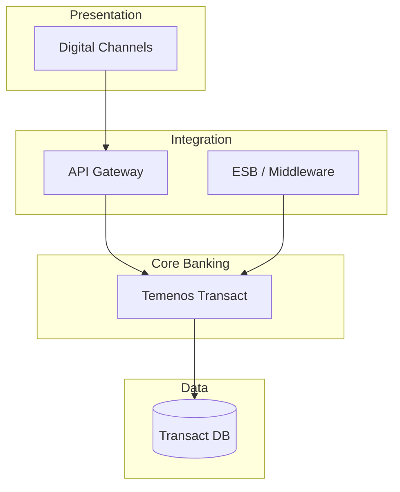

# Component Model

Logical component diagram for the target-state architecture.

## Diagram

## Component Descriptions

| Component | Responsibility | Technology | Owner |
|---|---|---|---|
| | | | |
