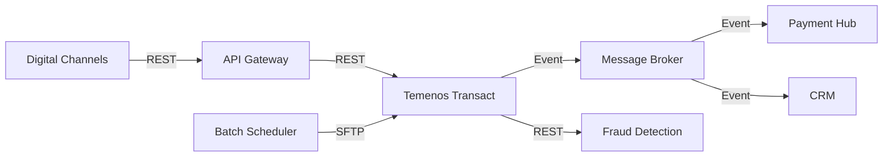

# Dependency Graph

Directed graph of system dependencies with protocol, SLA, and owner annotations.

## Diagram

## Edge Details

| From | To | Protocol | SLA | Owner |
|---|---|---|---|---|
| | | | | |
