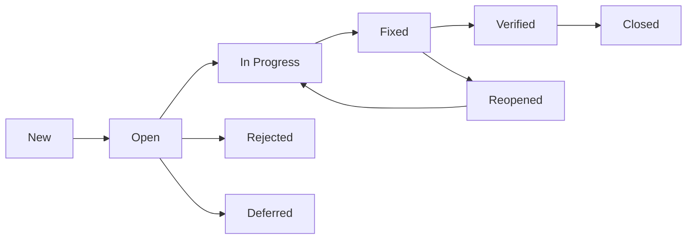

# Defect Taxonomy

Severity/priority classification and SLA per category.

## Severity Definitions

| Severity | Definition | Examples |
|---|---|---|
| Critical | System down, data loss, no workaround | Production outage, data corruption |
| High | Major function impaired, workaround exists | Transaction posting failure, incorrect balance |
| Medium | Minor function impaired, easy workaround | Report formatting, UI alignment |
| Low | Cosmetic, enhancement request | Typo, colour inconsistency |

## Priority Definitions

| Priority | Definition | Response SLA | Resolution SLA |
|---|---|---|---|
| P1 | Fix immediately | 1 hour | 4 hours |
| P2 | Fix in current sprint | 4 hours | 2 days |
| P3 | Fix in next sprint | 1 day | 1 sprint |
| P4 | Backlog | 3 days | Best effort |

## Defect Lifecycle

## Classification Rules

| Rule | Severity | Priority |
|---|---|---|
| Data loss or corruption | Critical | P1 |
| Security vulnerability | Critical | P1 |
| Core banking function failure | High | P1 |
| Integration failure | High | P2 |
| Performance degradation > 50% | High | P2 |
| UI/UX issue | Medium | P3 |
| Documentation gap | Low | P4 |
