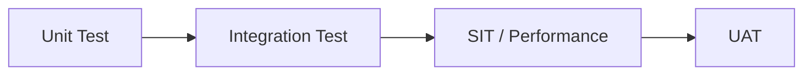

# Test Strategy

Four-phase testing approach for the Temenos Transact implementation.

## Phases

## Phase Definitions

### Phase 1: Unit Test
| Attribute | Detail |
|---|---|
| Scope | Individual components, routines, APIs |
| Owner | Development team |
| Environment | DEV |
| Automation Target | ≥ 80% |
| Entry | Code complete, peer reviewed |
| Exit | All unit tests pass, coverage ≥ 80% |

### Phase 2: Integration Test
| Attribute | Detail |
|---|---|
| Scope | System-to-system interfaces, API contracts |
| Owner | Integration team |
| Environment | SIT |
| Automation Target | ≥ 60% |
| Entry | Unit test exit met, interfaces deployed |
| Exit | All integration scenarios pass |

### Phase 3: SIT / Performance
| Attribute | Detail |
|---|---|
| Scope | End-to-end business processes, load/stress |
| Owner | Test team |
| Environment | SIT / PERF |
| Automation Target | ≥ 40% |
| Entry | Integration test exit met |
| Exit | All SIT scenarios pass, performance benchmarks met |

### Phase 4: UAT
| Attribute | Detail |
|---|---|
| Scope | Business acceptance scenarios |
| Owner | Business users |
| Environment | UAT |
| Automation Target | Traceability only |
| Entry | SIT exit met, UAT environment refreshed |
| Exit | Business sign-off, all critical/high defects resolved |
