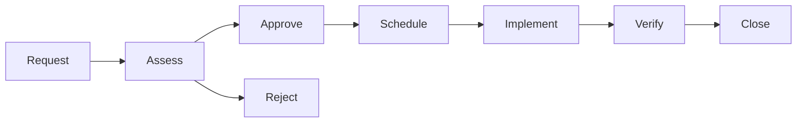

# Change Management

Post-go-live change request process.

## Change Types

| Type | Description | Approval | Lead Time |
|---|---|---|---|
| Standard | Pre-approved, low-risk changes | Automated | 1 day |
| Normal | Requires review and approval | CAB | 5 days |
| Emergency | Urgent fix for production issue | Emergency CAB | 4 hours |

## Change Lifecycle

## Change Advisory Board (CAB)

| Role | Member | Voting |
|---|---|---|
| Chair | Head of Technology | Yes |
| Business Rep | Head of Banking Ops | Yes |
| Technical Lead | Application Lead | Yes |
| Security | Security Lead | Yes |
| Vendor | Temenos Account Manager | Advisory |

## Change Windows

| Window | Day | Time | Risk Level |
|---|---|---|---|
| Standard | Saturday | 02:00–06:00 | Low–Medium |
| Emergency | Any | As needed | High (with approval) |

## Rollback Plan

Every change must include:
- Rollback procedure
- Rollback time estimate
- Verification steps post-rollback
