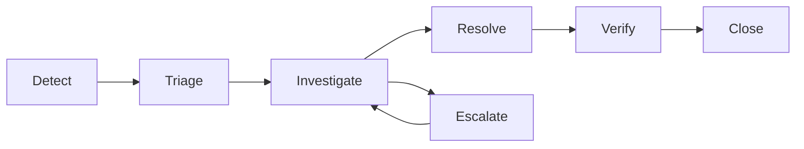

# Incident Management

Incident classification and response process.

## Incident Classification

| Severity | Definition | Examples | Response |
|---|---|---|---|
| SEV1 — Critical | System down, data loss, security breach | Core banking unavailable, data corruption | Immediate war room |
| SEV2 — High | Major function impaired | Transaction posting failure, integration down | 30 min response |
| SEV3 — Medium | Minor function impaired | Report failure, UI issue | 2 hour response |
| SEV4 — Low | Cosmetic, enhancement | Typo, minor display issue | Next business day |

## Incident Lifecycle

## Response Process

| Step | Action | Owner | SLA |
|---|---|---|---|
| 1. Detect | Monitoring alert or user report | L1 | — |
| 2. Triage | Classify severity, assign priority | L1 | 15 min |
| 3. Investigate | Root cause analysis | L2/L3 | Per priority |
| 4. Resolve | Apply fix or workaround | L2/L3 | Per priority |
| 5. Verify | Confirm resolution with reporter | L1 | 30 min |
| 6. Close | Document root cause, update KB | L1 | 1 hour |

## Post-Incident Review

| Attribute | Requirement |
|---|---|
| Trigger | All SEV1 and SEV2 incidents |
| Timing | Within 48 hours of resolution |
| Output | Root cause, contributing factors, action items |
| Follow-up | Action items tracked to completion |
