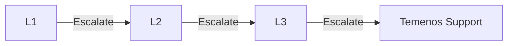

# Support Tiers

L1/L2/L3 definitions, escalation paths, and SLAs.

## Tier Definitions

### L1 — Service Desk
| Attribute | Detail |
|---|---|
| Scope | First contact, triage, known-issue resolution, password resets |
| Skills | Product knowledge, ticket management |
| Tools | Service desk platform, knowledge base |
| Resolution Target | 70% of tickets |

### L2 — Application Support
| Attribute | Detail |
|---|---|
| Scope | Investigation, configuration changes, data fixes, minor code changes |
| Skills | Transact configuration, SQL, basic debugging |
| Tools | Transact admin, database tools, monitoring |
| Resolution Target | 25% of tickets |

### L3 — Engineering
| Attribute | Detail |
|---|---|
| Scope | Deep diagnostics, code fixes, performance tuning, vendor escalation |
| Skills | Transact internals, Java/TAFJ, database optimisation |
| Tools | IDE, profiler, source control |
| Resolution Target | 5% of tickets |

## Escalation Path

## SLAs

| Priority | L1 Response | L2 Response | L3 Response | Resolution |
|---|---|---|---|---|
| P1 — Critical | 15 min | 30 min | 1 hour | 4 hours |
| P2 — High | 30 min | 2 hours | 4 hours | 1 business day |
| P3 — Medium | 2 hours | 1 business day | 2 business days | 1 sprint |
| P4 — Low | 4 hours | 2 business days | Best effort | Best effort |
