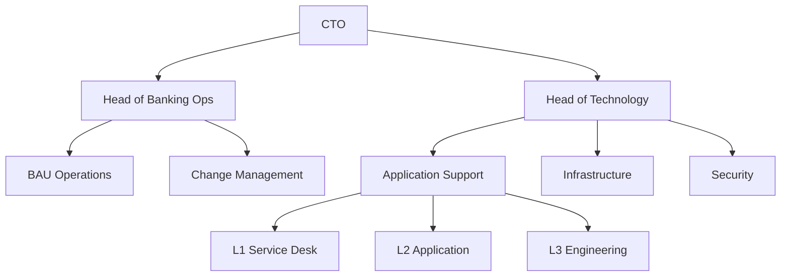

# Target Operating Model

Run-state organisational structure and responsibilities.

## Organisation Structure

## Roles & Responsibilities

| Role | Responsibilities | Headcount |
|---|---|---|
| Head of Banking Ops | Overall run-state ownership, business alignment | |
| Head of Technology | Technical operations, platform stability | |
| L1 Service Desk | First contact, triage, known-issue resolution | |
| L2 Application Support | Investigation, configuration changes, minor fixes | |
| L3 Engineering | Deep diagnostics, code fixes, vendor escalation | |
| BAU Operations | Day-to-day banking operations | |
| Change Management | Change request processing, release coordination | |
| Infrastructure | Server, network, database management | |
| Security | Access management, vulnerability management | |

## Handover from Programme

| Area | Programme Team | BAU Team | Handover Date |
|---|---|---|---|
| Application Support | | | |
| Infrastructure | | | |
| Documentation | | | |
| Vendor Relationships | | | |
