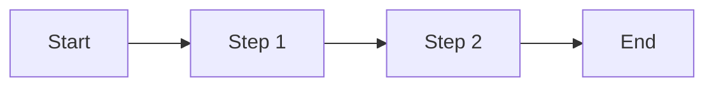

# <Process Name>

## Current State
How the bank does this today.

## Target State (Transact)
How Transact handles this out-of-the-box. Packaged business capability reference.

## Gap Notes
What doesn't fit. Links to customisation request if gap confirmed.

## Diagram

