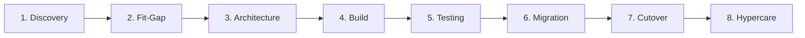
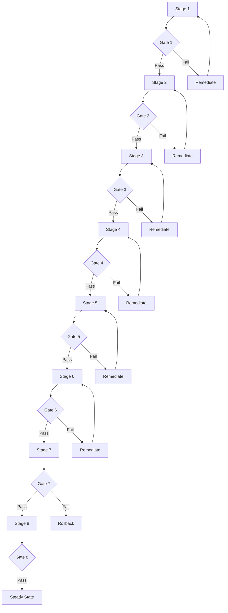

# Lifecycle Overview

Visual lifecycle and stage-to-artefact mapping.

## Lifecycle Flow

## Gate Decisions

## Stage Summaries

### Stage 1: Discovery
Understand the bank's current state, strategic objectives, and programme scope. Produce the initial target-state reference architecture.

### Stage 2: Fit-Gap & Process Design
Assess each Transact module against business requirements. Score gaps, track customisation budget, and begin data quality profiling.

### Stage 3: Solution Architecture
Author ADRs, finalise the target-state architecture, create the integration dependency map, and define the test strategy framework.

### Stage 4: Build & Configure
Implement Transact configuration, customisations, and integrations. Update all artefacts as decisions evolve.

### Stage 5: Testing
Execute four-phase testing (Unit → Integration → SIT/Perf → UAT). Track KPIs and manage defects to gate criteria.

### Stage 6: Data Migration
Execute data profiling, cleansing, mapping, and rehearsals. Achieve quality gate thresholds for go-live.

### Stage 7: Cutover
Execute the cutover runbook, manage go/no-go decision, and transition to production.

### Stage 8: Hypercare
Stabilise the platform, transfer knowledge to BAU, and achieve steady-state operating model.
